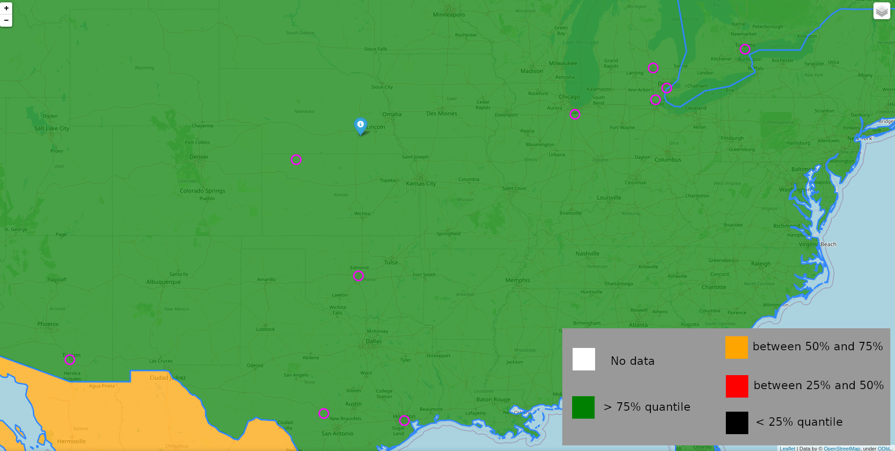

# 10 closest films
"10 closest films" project gives user the opportunity to see 10 films shot in given year, that are the closest to the user's location.

To use provided functionality, clone github repository by running 
```git clone https://github.com/bogdanmagometa/10-closest-films.git```
in your terminal, then run main.py file with the following command in the terminal:
```python main.py```

After running main.py the user is prompted to enter the year, coordinates (lattitude and longitude) and time in seconds for exceution of the program. Given the year and coordinates of the location, the program will generate a map with markers that represent ten closest locations, where films were shot in a given year.

Additionally, the map will have the layer with countries' territories colored. The color, a particular country is filled with, tells whether this particular country's GDP per capita is:
<ul>
<li>below 25th percentile (black color)</li>
<li>between 25th and 50th percentile (red color)</li>
<li>between 50th and 75th percentile (orange color)</li>
<li>above 75th percentile. (green color)</li>
</ul>

## Example of running the program
```
$ python main.py
Please enter a year you would like to have a map for: 2015
Please enter your location (format: lat, long): 40.6559262,-97.4307811
How much seconds do you want to wait (the more you wait, the better the results are)? 100
Map is generating...
Please wait...
Finished. Please have look at the map 2015_movies_map.html
```
<figure>
    
    <figcaption style="background-color: green" align="center">Example of map</figcaption>
</figure>

## HTML file structure
The generated HTML file has DOCTYPE instruction at the beginning of a file.
After that there is head, body and script tags. Head element contains some meta information that are not displayed, while contents of body element are displayed. script tag at the end of the file contains code that is excecuted.
